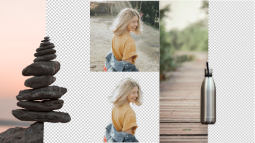
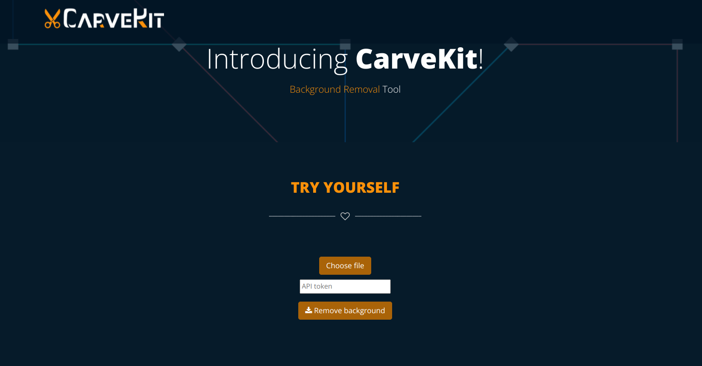
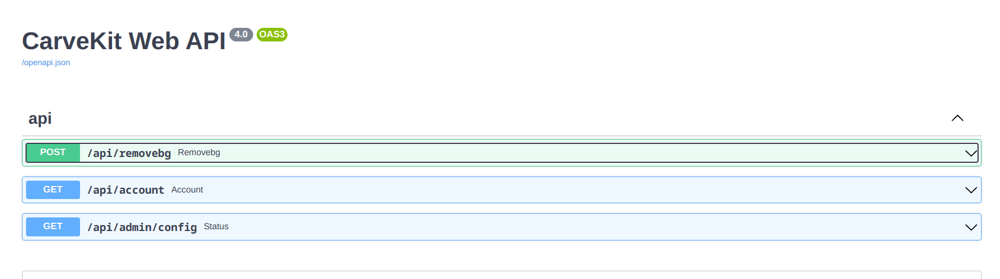

# <p align="center"> ✂️ CarveKit ✂️  </p>

<p align="center">  </p>

<p align="center">


<a src="https://colab.research.google.com/github/OPHoperHPO/image-background-remove-tool/blob/master/docs/other/carvekit_try.ipynb">
</a>

</p>


**********************************************************************
<p align="center">  </p>


> The higher resolution images from the picture above can be seen in the docs/imgs/compare/ and docs/imgs/input folders.

#### 📙 README Language
[Russian](docs/readme/ru.md)
[English](README.md)

## 📄 Description:  
Automated high-quality background removal framework for an image using neural networks.


## 🎆 Features:  
- High Quality
- Batch Processing
- NVIDIA CUDA and CPU processing
- Easy inference
- 100% remove.bg compatible FastAPI HTTP API 
- Removes background from hairs
- Easy integration with your code

## ⛱ Try yourself on [Google Colab](https://colab.research.google.com/github/OPHoperHPO/image-background-remove-tool/blob/master/docs/other/carvekit_try.ipynb) 
## ⛓️ How does it work?
It can be briefly described as
1. The user selects a picture or a folder with pictures for processing
2. The photo is preprocessed to ensure the best quality of the output image
3. Using machine learning technology, the background of the image is removed
4. Image post-processing to improve the quality of the processed image
## 🎓 Implemented Neural Networks:
* [U^2-net](https://github.com/NathanUA/U-2-Net)
* [BASNet](https://github.com/NathanUA/BASNet)
* [DeepLabV3](https://github.com/tensorflow/models/tree/master/research/deeplab)


## 🖼️ Image pre-processing and post-processing methods:
### 🔍 Preprocessing methods:
* `none` - No preprocessing methods used.
> They will be added in the future.
### ✂ Post-processing methods:
* `none` - No post-processing methods used.
* `fba` (default) - This algorithm improves the borders of the image when removing the background from images with hair, etc. using FBA Matting neural network. This method gives the best result in combination with u2net without any preprocessing methods.

## 🏷 Setup for CPU processing:
1. Clone this repository
2. `pip install -r requirements.txt --extra-index-url https://download.pytorch.org/whl/cpu`
3. `pip install ./`

## 🏷 Setup for GPU processing:  
1. Make sure you have an NVIDIA GPU with 8 GB VRAM.
2. Install `CUDA` and setup `PyTorch` for GPU processing.
3. `pip install -r requirements.txt --extra-index-url https://download.pytorch.org/whl/cu113`
4. `pip install ./`

## 🧰 Interact via code:  
### If you don't need deep configuration or don't want to deal with it
``` python
import torch
from carvekit.api.high import HiInterface

interface = HiInterface(batch_size_seg=5, batch_size_matting=1,
                               device='cuda' if torch.cuda.is_available() else 'cpu',
                               seg_mask_size=320, matting_mask_size=2048)
images_without_background = interface(['./tests/data/cat.jpg'])                               
cat_wo_bg = images_without_background[0]
cat_wo_bg.save('2.png')
                   
```

### If you want control everything
``` python
import PIL.Image

from carvekit.api.interface import Interface
from carvekit.ml.wrap.fba_matting import FBAMatting
from carvekit.ml.wrap.u2net import U2NET
from carvekit.pipelines.postprocessing import MattingMethod
from carvekit.pipelines.preprocessing import PreprocessingStub
from carvekit.trimap.generator import TrimapGenerator

u2net = U2NET(device='cpu',
              batch_size=1)

fba = FBAMatting(device='cpu',
                 input_tensor_size=2048,
                 batch_size=1)

trimap = TrimapGenerator()

preprocessing = PreprocessingStub()

postprocessing = MattingMethod(matting_module=fba,
                               trimap_generator=trimap,
                               device='cpu')

interface = Interface(pre_pipe=preprocessing,
                      post_pipe=postprocessing,
                      seg_pipe=u2net)

image = PIL.Image.open('tests/data/cat.jpg')
cat_wo_bg = interface([image])[0]
cat_wo_bg.save('2.png')
                   
```


## 🧰 Running the CLI interface:  
 * ```python3 -m carvekit  -i <input_path> -o <output_path> --device <device>```  
 
### Explanation of args:  
````
Usage: carvekit [OPTIONS]

  Performs background removal on specified photos using console interface.

Options:
  -i ./2.jpg                   Path to input file or dir  [required]
  -o ./2.png                   Path to output file or dir
  --pre none                   Preprocessing method
  --post fba                   Postprocessing method.
  --net u2net                  Segmentation Network
  --recursive                  Enables recursive search for images in a folder
  --batch_size 10              Batch Size for list of images to be loaded to
                               RAM

  --batch_size_seg 5           Batch size for list of images to be processed
                               by segmentation network

  --batch_size_mat 1           Batch size for list of images to be processed
                               by matting network

  --seg_mask_size 320          The size of the input image for the
                               segmentation neural network.

  --matting_mask_size 2048     The size of the input image for the matting
                               neural network.

  --device cpu                 Processing Device.
  --help                       Show this message and exit.

````
## 📦 Running the Framework / FastAPI HTTP API server via Docker:

Using the API via docker is a **fast** and non-complex way to have a working API.\
**This HTTP API is 100% compatible with remove.bg API clients.** 
<p align="center"> 
 
 
</p>

>### Important Notes:
>1. Docker image has default front-end at `/` url and FastAPI backend with docs at `/docs` url.
>2. Authentication is **enabled** by default. \
> **Token keys are reset** on every container restart if ENV variables are not set. \
See `docker-compose.<device>.yml` for more information. \
> **You can see your access keys in the docker container logs.**
> 
>3. There are examples of interaction with the API.\
> See `docs/code_examples/python` for more details
### 🔨 Creating and running a container:
1. Install `docker-compose`
2. Run `docker-compose -f docker-compose.cpu.yml up -d`  # For CPU Processing
3. Run `docker-compose -f docker-compose.cuda.yml up -d`  # For GPU Processing
> Also you can mount folders from your host machine to docker container
> and use the CLI interface inside the docker container to process 
> files in this folder. 

## ☑️ Testing

### ☑️ Testing with local environment
1. `pip install -r requirements_test.txt`
2. `pytest`

### ☑️ Testing with Docker
1. Run `docker-compose -f docker-compose.cpu.yml run carvekit_api pytest`  # For testing on CPU
2. Run `docker-compose -f docker-compose.cuda.yml run carvekit_api pytest`  # For testing on GPU


## 👪 Credits: [More info](docs/CREDITS.md)

## 💵 Support
  You can thank me for developing this project and buy me a small cup of coffee ☕

| Blockchain |            Cryptocurrency           |          Network          |                                              Wallet                                             |
|:----------:|:-----------------------------------:|:-------------------------:|:-----------------------------------------------------------------------------------------------:|
|  Ethereum  | ETH / USDT / USDC / BNB / Dogecoin  |          Mainnet          |                            0x7Ab1B8015020242D2a9bC48F09b2F34b994bc2F8                           |
|  Ethereum  |  ETH / USDT / USDC / BNB / Dogecoin | BSC (Binance Smart Chain) |                            0x7Ab1B8015020242D2a9bC48F09b2F34b994bc2F8                           |
|   Bitcoin  |                 BTC                 |             -             |                            bc1qmf4qedujhhvcsg8kxpg5zzc2s3jvqssmu7mmhq                           |
|    ZCash   |                 ZEC                 |             -             |                               t1d7b9WxdboGFrcVVHG2ZuwWBgWEKhNUbtm                               |
|    Tron    |                 TRX                 |             -             |                                TH12CADSqSTcNZPvG77GVmYKAe4nrrJB5X                               |
|   Monero   |                 XMR                 |          Mainnet          | 48w2pDYgPtPenwqgnNneEUC9Qt1EE6eD5MucLvU3FGpY3SABudDa4ce5bT1t32oBwchysRCUimCkZVsD1HQRBbxVLF9GTh3 |
|     TON    |                 TON                 |             -             |                         EQCznqTdfOKI3L06QX-3Q802tBL0ecSWIKfkSjU-qsoy0CWE                        |
## 📧 __Feedback__
I will be glad to receive feedback on the project and suggestions for integration.

For all questions write: [farvard34@gmail.com](mailto://farvard34@gmail.com)
